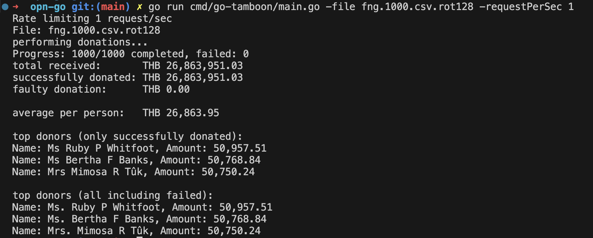

### This project is assignment for OPN from Nattapat Duangkaew

#### Run code
```sh
# Prerequisite: Export env variables
export OMISE_PUBLIC_KEY="pkey_test_<key>"
export OMISE_SECRET_KEY="skey_test_<key>"

# To run main program
go run cmd/go-tamboon/main.go -requestPerSec 4 -file fng.1000.csv.rot128
# OR
./bin/go-tamboon -requestPerSec 4 -file fng.1000.csv.rot128
```

#### Command options
-requestPerSec: Number of request/sec, default to number cpu in the running machine

-file: Path to encrypted file ex: fng.1000.csv.rot128, '/Users/{user}/Desktop/fng.1000.csv.rot128'


#### Build Command
```sh
go build -o ./bin/go-tamboon cmd/go-tamboon/main.go
```

#### Screenshot from finished result
There are a lot of errors due to low rate limit on Vault api for token creation

To make all charges pass rate limit we could specify `-requestPerSec` option to `1`


